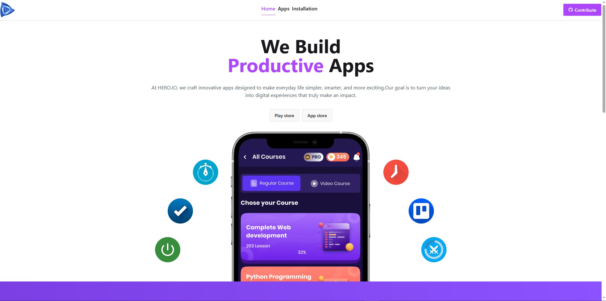
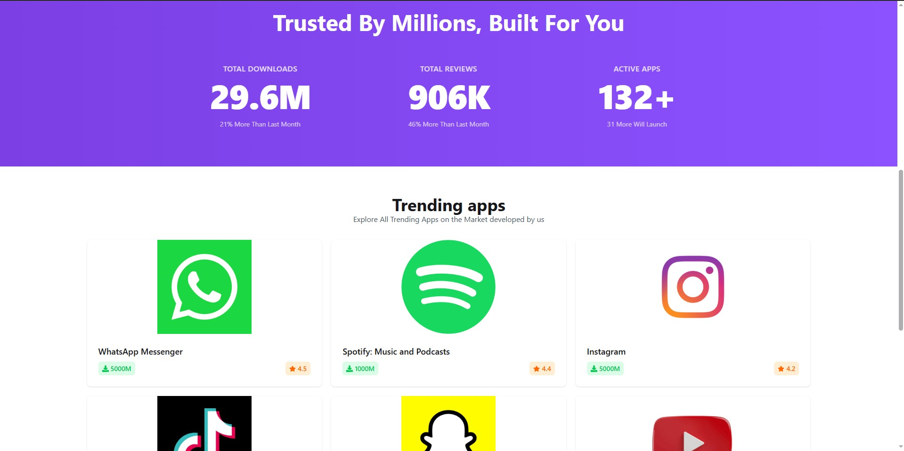

# 🛍️ PH Play Store

A modern app store web application built with React and Vite — browse, explore, and discover apps through a clean, responsive interface.

🔗 **Live Demo:** [ph-play-store-one.vercel.app](https://ph-play-store-one.vercel.app)

---

## 📸 Screenshots




---

## ✨ Features

- 🔍 **App Discovery** — Browse and explore a curated list of applications
- 📱 **Responsive Design** — Fully optimized for mobile, tablet, and desktop
- ⚡ **Fast Performance** — Built with Vite for lightning-fast load times
- 🎨 **Clean UI** — Modern interface styled with Tailwind CSS

---

## 🛠️ Tech Stack

| Technology | Purpose |
|---|---|
| React.js (Vite) | UI framework & build tool |
| Tailwind CSS | Styling & responsive layout |
| JavaScript ES6+ | Core application logic |

---

## 🚀 Getting Started

### Prerequisites

- [Node.js](https://nodejs.org/) (v16 or higher)
- [Git](https://git-scm.com/)

### Installation

1. **Clone the repository**
```bash
   git clone https://github.com/SAIEED12/PH-Play_Store.git
   cd PH-Play_Store
```

2. **Install dependencies**
```bash
   npm install
```

3. **Start the development server**
```bash
   npm run dev
```

4. **Open in your browser**
```
   http://localhost:5173
```

### Build for Production

```bash
npm run build
```

The output will be in the `dist/` folder, ready to deploy.

